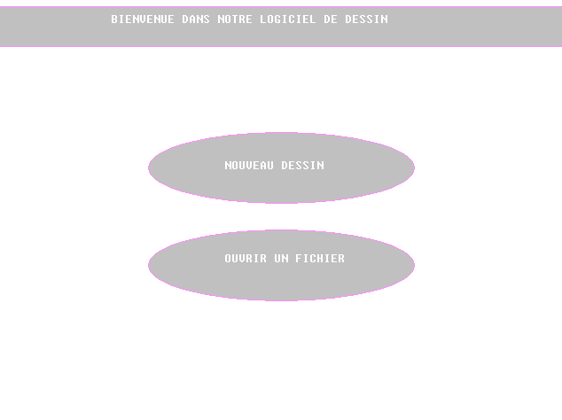
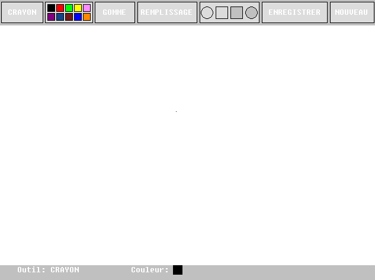
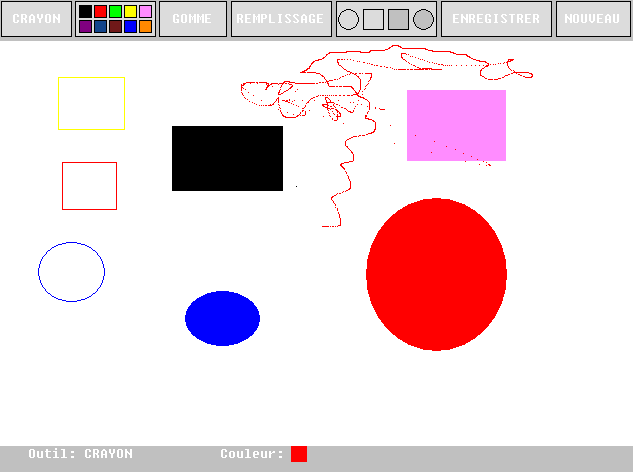

# DAO – Logiciel de dessin en assembleur 68000

> **DAO** estun logiciel de dessin assisté par ordinateur, développé en assembleur 68000 et exécuté sur le simulateur EASy68K, permettant de dessiner à l’écran à l’aide de la souris via une interface graphique simple.
> 
## 🎯 Objectif

Réaliser un logiciel de dessin bas niveau afin de mettre en pratique :

* La programmation en assembleur 68000
* La gestion de la souris
* L’affichage graphique
* Une interface utilisateur interactive

## 📸 Aperçu

### Menu d’accueil



### Interface de dessin



### Exemple de dessin



## 🧠 Fonctionnalités

* Menu d’accueil
* Interface de dessin avec :

  * Barre d’outils
  * Palette de couleurs
  * Zone de dessin
* Outils disponibles :

  * Crayon
  * Gomme
  * Remplissage
  * Formes simples

## 🛠️ Prérequis

* Simulateur **EASy68K**

## ▶️ Lancement

1. Ouvrir **EASy68K**
2. Charger le fichier `main.X68`
3. Assembler le programme
4. Lancer l’exécution

## 🧑‍🎨 Utilisation

* Cliquer sur **NOUVEAU DESSIN** dans le menu d’accueil
* Choisir un outil et une couleur
* Dessiner dans la zone prévue à l’écran à l’aide de la souris

## 📁 Structure du projet

```text
dao/
├── main.X68        # Programme principal
├── menu.X68        # Menu d’accueil
├── dessiner.X68    # Fonctions de dessin
├── affichage.X68   # Interface graphique
├── BIBGRAPH.X68    # Bibliothèque graphique
├── BIBLIO.X68      # Bibliothèque générale
├── BIBPERIPH.X68   # Gestion de la souris
└── README.md
```

## 📈 Améliorations possibles

* Ajouter plus de formes
* Modifier l’épaisseur du crayon
* Sauvegarde / ouverture de dessins
* Zoom ou grille


## 🚀 Démo
🔗 Découvrez TicTacToe et testez-le ici : https://tictactoehost.netlify.app/


